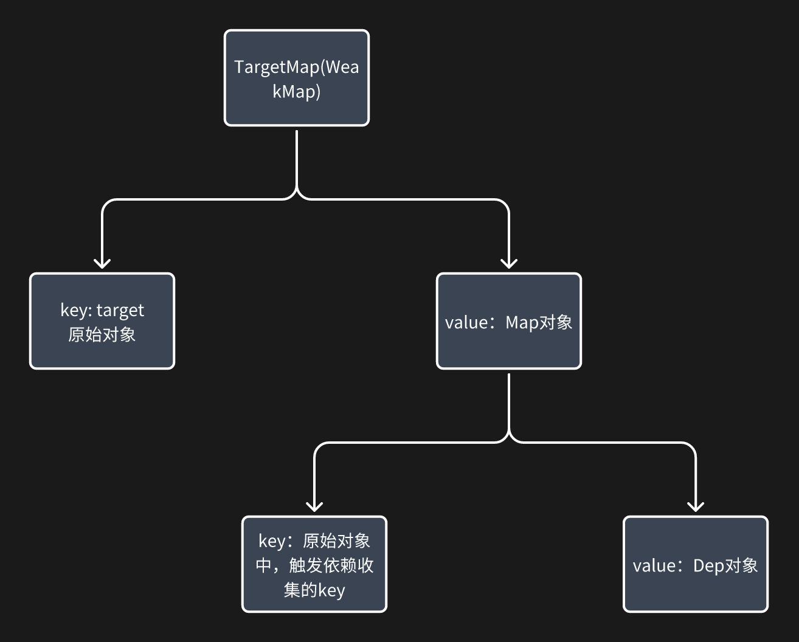
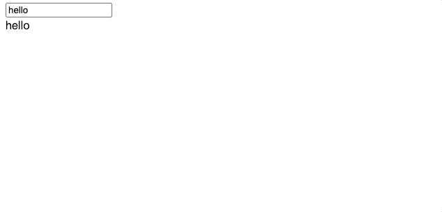

# Vue 3 响应式实现思路

下面这个 Demo 是一个极简版的响应式系统实现，可以帮助我们快速理解 Vue 3 `reactivity` 的核心机制。  
通过它，你能直观地看到响应式数据是如何与视图绑定、自动更新的👇

## 1. 编写基础的 HTML 结构

```html
<!DOCTYPE html>
<html lang="en">
<head>
    <meta charset="UTF-8">
    <meta name="viewport" content="width=device-width, initial-scale=1.0">
    <title>Document</title>
</head>
<body>
    <input type="text" id="input" />
    <div id="output"></div>
    <script></script>
</body>
</html>
```

- 有一个输入框和一个用于显示内容的 `div`。
- script 标签内我们将实现响应式逻辑。

## 2. 创建响应式函数`reactive`

接下来我们写一个简单的reactive函数, track和trigger先留空。reactive就是使用proxy对对象进行劫持代理，这里我们就不做一堆的校验了，怎么简单怎么来，方便理解

```html
<!DOCTYPE html>
<html lang="en">
<head>
    <meta charset="UTF-8">
    <meta name="viewport" content="width=device-width, initial-scale=1.0">
    <title>Document</title>
</head>
<body>
    <input type="text" id="input" />
    <div id="output"></div>

    <script>
        function reactive(obj) {
            return new Proxy(obj, {
                get(target, key, receiver) {
                    const result = Reflect.get(target, key, receiver)
                    // get时 收集依赖
                    track(target, key)
                    return result
                },
                set(target, key, value, receiver) {
                    const result = Reflect.set(target, key, value, receiver)
                    // set时 触发依赖，注意trigger需要在设置完新值之后
                    trigger(target, key, value)
                    return result
                }
            })
        }
        
        function track(target, key) {
            console.log('track', target, key)
        }
        function trigger(target, key, value) {
            console.log('trigger', target, key, value)
        }
    </script>
</body>
</html>
```

## 3. 下一步该填充track和trigger了。

我们需要一个WeakMap建立起对象和依赖的关系，然后还需要一个Map分别存储每个key对应的依赖，最后则是用Set去存储依赖,
大概的数据结构像下图👇。
为了方便理解，我们暂且将Dep对象理解为一个Set集合，后面我们会讲解为什么Vue 3中要用Dep类来实现。


```html
<!DOCTYPE html>
<html lang="en">
<head>
    <meta charset="UTF-8">
    <meta name="viewport" content="width=device-width, initial-scale=1.0">
    <title>Document</title>
</head>
<body>
    <input type="text" id="input" />
    <div id="output"></div>

    <script>
        function reactive(obj) {
            return new Proxy(obj, {
                get(target, key, receiver) {
                    const result = Reflect.get(target, key, receiver)
                    track(target, key)
                    return result
                },
                set(target, key, value, receiver) {
                    const result = Reflect.set(target, key, value, receiver)
                    trigger(target, key, value)
                    return result
                }
            })
        }

        let activeEffect = null

        const targetMap = new WeakMap()
        function track(target, key) {
            const depsMap = targetMap.get(target) || new Map()
            targetMap.set(target, depsMap)
            const dep = depsMap.get(key) || new Set()
            depsMap.set(key, dep)
            if (activeEffect) {
                dep.add(activeEffect)
            }
        }
        function trigger(target, key, value) {
            const depsMap = targetMap.get(target)
            if (!depsMap) return
            const dep = depsMap.get(key)
            if (!dep) return
            dep.forEach(effect => effect())
        }
    </script>
</body>
</html>
```

## 4. 最后，创建一个effect函数，建立依赖和响应式对象的关系。

在`effect`函数中，我们将传入的函数赋值给`activeEffect`，然后执行这个函数，这样在执行过程中访问响应式对象时，就会触发`get`
，从而调用`track`进行依赖收集。执行完后，我们将`activeEffect`重置为`null`，以避免不必要的依赖收集。
这样我们就完成了一个简单的响应式系统，可以实现数据变化时自动更新视图。

然后在第二个script标签中，我们创建一个响应式对象`state`，并使用`effect`
函数来绑定输入框和显示区域的内容。最后，我们添加一个输入事件监听器，当输入框的内容变化时，更新响应式对象的`text`属性，从而触发视图更新。

**完整Demo如下**

```html
<!DOCTYPE html>
<html lang="en">
<head>
    <meta charset="UTF-8" />
    <meta name="viewport" content="width=device-width, initial-scale=1.0" />
    <title>Document</title>
</head>
<body>
<input type="text" id="input" />
<div id="output"></div>

<script>
    function reactive(obj) {
        return new Proxy(obj, {
            get(target, key, receiver) {
                const result = Reflect.get(target, key, receiver);
                track(target, key);
                return result;
            },
            set(target, key, value, receiver) {
                const result = Reflect.set(target, key, value, receiver);
                trigger(target, key, value);
                return result;
            },
        });
    }

    let activeEffect = null;

    const targetMap = new WeakMap();
    function track(target, key) {
        const depsMap = targetMap.get(target) || new Map();
        targetMap.set(target, depsMap);
        const dep = depsMap.get(key) || new Set();
        depsMap.set(key, dep);
        if (activeEffect) {
            dep.add(activeEffect);
        }
    }
    function trigger(target, key, value) {
        const depsMap = targetMap.get(target);
        if (!depsMap) return;
        const dep = depsMap.get(key);
        if (!dep) return;
        dep.forEach((effect) => effect());
    }

    function effect(fn) {
        activeEffect = fn;
        fn();
        activeEffect = null;
    }
</script>

<script>
    const state = reactive({ text: "hello" });
    const input = document.getElementById("input");
    const output = document.getElementById("output");
    effect(() => {
        input.value = state.text;
        output.innerText = state.text;
    });
    input.addEventListener("input", (e) => {
        state.text = e.target.value;
    });
    setTimeout(() => {
        state.text = "hello vue3";
    }, 2000);
</script>
</body>
</html>
```

然后我们可以看下效果，输入框和显示区域会随着输入内容的变化而自动更新，并且两秒后会自动变成"hello vue3"。



## 5. 小结

通过这个简单的 Demo，我们实现了一个基本的响应式系统，涵盖了响应式对象的创建、依赖收集和变更触发的核心机制。  
虽然这个实现非常简化，但它帮助我们理解了 Vue 3 `reactivity` 包的核心设计思路。  
在实际的 Vue 3 实现中，还有更多复杂的功能和优化，比如调度器、effectScope、computed
等等，但这些都是建立在我们刚才理解的基础之上的。  
希望这个 Demo 能帮助你更好地理解 Vue 3 的响应式系统！  
接下来，我们会逐步拆解 Vue 3 `reactivity` 的源码，深入理解每个部分的实现细节。