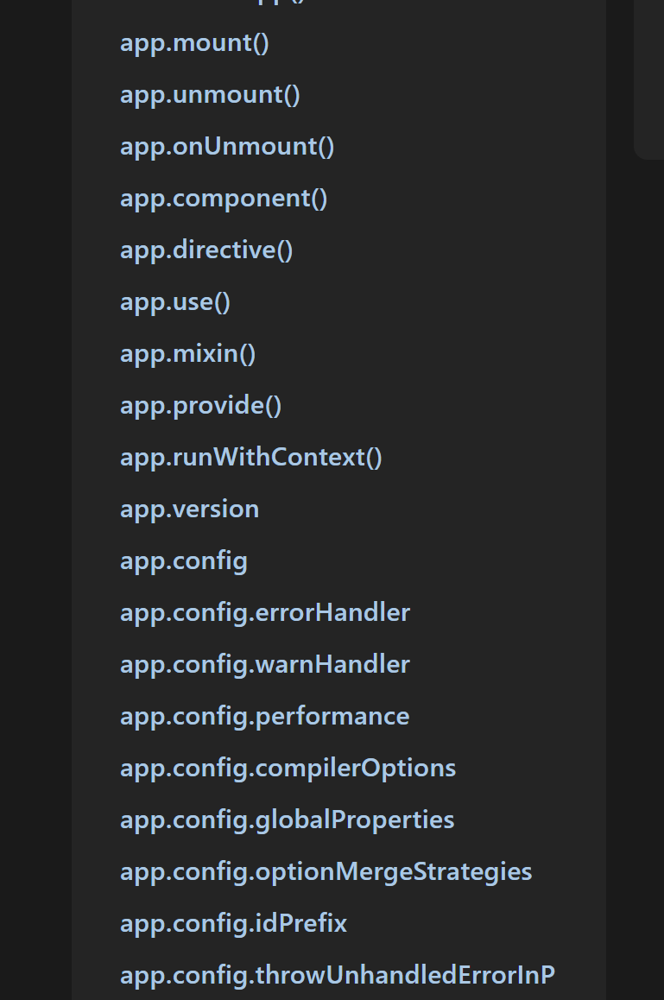

# CreateApp

`createApp`是Vue 3中用于创建应用实例的函数。它允许你创建一个新的Vue应用，并挂载到指定的DOM元素上。
因为涉及到Dom相关的操作，所以`createApp`位于`runtime-dom`包中。
路径为`packages/runtime-dom/src/index.ts`

## 代码实现

完整源码如下：

```ts
export const createApp = ((...args) => {
    // 懒加载 renderer，调用 createApp 时才创建
    const app = ensureRenderer().createApp(...args)

    if (__DEV__) {
        injectNativeTagCheck(app)
        injectCompilerOptionsCheck(app)
    }

    const { mount } = app
    app.mount = (containerOrSelector: Element | ShadowRoot | string): any => {
        const container = normalizeContainer(containerOrSelector)
        if (!container) return

        const component = app._component
        if (!isFunction(component) && !component.render && !component.template) {
            // __UNSAFE__
            // Reason: potential execution of JS expressions in in-DOM template.
            // The user must make sure the in-DOM template is trusted. If it's
            // rendered by the server, the template should not contain any user data.
            component.template = container.innerHTML
            // 2.x compat check
            if (__COMPAT__ && __DEV__ && container.nodeType === 1) {
                for (let i = 0; i < (container as Element).attributes.length; i++) {
                    const attr = (container as Element).attributes[i]
                    if (attr.name !== 'v-cloak' && /^(v-|:|@)/.test(attr.name)) {
                        compatUtils.warnDeprecation(
                            DeprecationTypes.GLOBAL_MOUNT_CONTAINER,
                            null,
                        )
                        break
                    }
                }
            }
        }

        // clear content before mounting
        if (container.nodeType === 1) {
            container.textContent = ''
        }
        const proxy = mount(container, false, resolveRootNamespace(container))
        if (container instanceof Element) {
            container.removeAttribute('v-cloak')
            container.setAttribute('data-v-app', '')
        }
        return proxy
    }

    return app
}) as CreateAppFunction<Element>
```

我们一步步的解析：

## 创建app


```ts
export const createApp = ((...args) => {
    // 懒加载 renderer，调用 createApp 时才创建
    const app = ensureRenderer().createApp(...args)
    // ......
})

// lazy create the renderer - this makes core renderer logic tree-shakable
// in case the user only imports reactivity utilities from Vue.
// 延迟创建 renderer —— 这样可以让核心渲染逻辑支持按需 tree-shaking，
// 以防用户只从 Vue 导入响应式相关的工具。
let renderer: Renderer<Element | ShadowRoot> | HydrationRenderer

function ensureRenderer() {
    return (
        renderer ||
        (renderer = createRenderer<Node, Element | ShadowRoot>(rendererOptions))
    )
}
```

这里延迟创建renderer，确保tree-shaking正常工作。

应对的场景是用户只想使用Vue的响应式功能，而不需要完整的渲染器,例如：

```ts
// 导入了响应式，但是并不需要渲染器，比如只是想自己写个库之类的
import {reactive} from 'vue'
```

创建完渲染器后，调用渲染器提供的createApp函数来创建app实例。

### 渲染器的createApp

渲染器的`createApp`函数是通过调用`createAppApi`工厂方法创建的，位于`packages/runtime-core/src/apiCreateApp.ts`

```ts
export function createAppAPI<HostElement>(
    render: RootRenderFunction<HostElement>,
    hydrate?: RootHydrateFunction,
): CreateAppFunction<HostElement> {
    return function createApp(rootComponent, rootProps = null) {}
}
```

`createAppAPI`接收两个参数
- render：渲染函数
- hydrate：水合函数,用于SSR

我们暂且先放放这个渲染器，这个我们后面会讲到。先看看`createApp`函数的实现。

```ts
return function createApp(rootComponent, rootProps = null) {
    // 兼容createApp的rootComponent参数为options的情况
    if (!isFunction(rootComponent)) {
        rootComponent = extend({}, rootComponent)
    }

    // 对rootProps进行校验
    if (rootProps != null && !isObject(rootProps)) {
        __DEV__ && warn(`root props passed to app.mount() must be an object.`)
        rootProps = null
    }

    // 创建app上下文
    const context = createAppContext()
    // 创建一个集合，存储插件
    const installedPlugins = new WeakSet()
    // 存储卸载时的回调函数
    const pluginCleanupFns: Array<() => any> = []

    let isMounted = false
    const app: App = (context.app = {})

    return app
}
```

先省略app的实现细节，我们看到`createApp`函数接收两个参数

- rootComponent：根组件
- rootProps：根组件的props

然后执行逻辑

- 对rootComponent和rootProps进行校验，确保传入的参数是合法的。
- 接着创建app上下文`context`，用于存储应用的全局状态和配置。
- 然后创建一个WeakSet`installedPlugins`，用于存储已经安装的插件，防止重复安装。
- 创建一个数组`pluginCleanupFns`，用于存储插件卸载时的回调函数。
- 初始化一个标志`isMounted`，用于跟踪应用是否已经挂载。
- 最后创建一个app对象，并将其赋值给上下文的app属性。
- 返回这个对象

### app对象

```ts
const app = {
    _uid: uid++, // 组件唯一标识符
    _component: rootComponent as ConcreteComponent, // 组件实例
    _props: rootProps, // 组件props
    _container: null, // 挂载容器
    _context: context, // app上下文
    _instance: null, // 组件内部实例

    version, // vue版本号

    // app配置对象
    get config() {
        return context.config
    },
    // 禁止替换config属性
    set config(v) {
        if (__DEV__) {
            warn(
                `app.config cannot be replaced. Modify individual options instead.`,
            )
        }
    },
    
    // 方法
    use(plugin: Plugin, ...options: any[]) {},
    mixin(mixin: ComponentOptions) {},
    component(name: string, component?: Component): any {},
    directive(name: string, directive?: Directive) {},
    mount(
        rootContainer: HostElement,
        isHydrate?: boolean,
        namespace?: boolean | ElementNamespace,
    ): any {},
    onUnmount(cleanupFn: () => void) {},
    unmount() {},
    provide(key, value) {},
    runWithContext(fn) {},
    
}
```

可以看到，app对象包含了很多属性和方法，用于管理应用的生命周期、组件注册、指令注册等功能。也就是我们在api文档里看到的那些方法。



大部分方法的实现都较为统一，就是将对应的入参进行一定的校验，然后存储到app上下文中，如`provide`、`component`等，实现较为简单，这里不过多赘述，我们后面调用的时候会关注一下`mount`方法，这里先按下不表。


## 注入检测函数

渲染器的`createApp`函数执行完后，回到`runtime-dom`的`createApp`函数中，继续往下看：

```ts
if (__DEV__) {
    // 注入 native tag 检测, 在app.config中，有个isNativeTag的私有方法，用于检测是否原生标签
    // 因为在开发模式下，Vue 会对组件名称进行验证，以确保用户没有尝试注册与原生 HTML 或 SVG 标签同名的组件。
    // 放到runtime-dom中实现，是因为不同平台需要检测的原生标签不一样，而runtime-dom中则是检测与dom相关的标签
    injectNativeTagCheck(app)
    // 注入自定义标签检测函数
    injectCompilerOptionsCheck(app)
}
```

- 注入native tag检测函数，用于检测确保用户没有注册与原生HTML或SVG标签同名的组件。
- 注入自定义标签检测函数，确保用户传递的编译器选项是有效的。

## 重写`mount`方法

```ts
const { mount } = app
app.mount = (containerOrSelector: Element | ShadowRoot | string): any => {
    // 获取挂载容器节点
    const container = normalizeContainer(containerOrSelector)
    if (!container) return

    // 获取应用的根组件
    const component = app._component
    // 如果组件不是函数且没有定义 render 或 template，则尝试从容器的 innerHTML 中提取模板
    if (!isFunction(component) && !component.render && !component.template) {
        // __UNSAFE__
        // Reason: potential execution of JS expressions in in-DOM template.
        // The user must make sure the in-DOM template is trusted. If it's
        // rendered by the server, the template should not contain any user data.
        // 不安全
        // 原因：可能会在 DOM 中的模板中执行 JS 表达式。
        // 用户必须确保 DOM 中的模板是可信的。如果模板由服务器渲染，则不应包含任何用户数据。
        component.template = container.innerHTML
        // 2.x compat check
        // 兼容 Vue 2.x 的检查逻辑
        if (__COMPAT__ && __DEV__ && container.nodeType === 1) {
            for (let i = 0; i < (container as Element).attributes.length; i++) {
                const attr = (container as Element).attributes[i]
                // 如果属性名称不是 v-cloak 且以 v-、: 或 @ 开头，则发出弃用警告
                if (attr.name !== 'v-cloak' && /^(v-|:|@)/.test(attr.name)) {
                    compatUtils.warnDeprecation(
                        DeprecationTypes.GLOBAL_MOUNT_CONTAINER,
                        null,
                    )
                    break
                }
            }
        }
    }

    // clear content before mounting
    // 挂载之前清空内容
    if (container.nodeType === 1) {
        container.textContent = ''
    }
    // 执行挂载函数
    const proxy = mount(container, false, resolveRootNamespace(container))
    // 如果容器是元素节点，则移除 v-cloak 属性并添加 data-v-app 属性
    if (container instanceof Element) {
        container.removeAttribute('v-cloak')
        container.setAttribute('data-v-app', '')
    }
    return proxy
}
```

这里重写了app的`mount`方法，实现了应用的挂载逻辑。

- 首先通过`normalizeContainer`函数获取挂载容器节点。
- 然后获取应用的根组件，如果根组件没有定义`render`或`template`，则尝试从容器的`innerHTML`中提取模板。
- 在挂载之前清空容器的内容。
- 最后调用原始的`mount`方法执行挂载，并返回组件实例的代理对象。

### 原始`mount`方法

```ts
const app = {
    mount(
        rootContainer: HostElement,
        isHydrate?: boolean,
        namespace?: boolean | ElementNamespace,
    ): any {
        if (!isMounted) {
            // #5571
            if (__DEV__ && (rootContainer as any).__vue_app__) {
                warn(
                    `There is already an app instance mounted on the host container.\n` +
                    ` If you want to mount another app on the same host container,` +
                    ` you need to unmount the previous app by calling \`app.unmount()\` first.`,
                )
            }
            const vnode = app._ceVNode || createVNode(rootComponent, rootProps)
            // store app context on the root VNode.
            // this will be set on the root instance on initial mount.
            vnode.appContext = context

            if (namespace === true) {
                namespace = 'svg'
            } else if (namespace === false) {
                namespace = undefined
            }

            // HMR root reload
            if (__DEV__) {
                context.reload = () => {
                    const cloned = cloneVNode(vnode)
                    // avoid hydration for hmr updating
                    cloned.el = null
                    // casting to ElementNamespace because TS doesn't guarantee type narrowing
                    // over function boundaries
                    render(cloned, rootContainer, namespace as ElementNamespace)
                }
            }

            if (isHydrate && hydrate) {
                hydrate(vnode as VNode<Node, Element>, rootContainer as any)
            } else {
                render(vnode, rootContainer, namespace)
            }
            isMounted = true
            app._container = rootContainer
            // for devtools and telemetry
            ;(rootContainer as any).__vue_app__ = app

            if (__DEV__ || __FEATURE_PROD_DEVTOOLS__) {
                app._instance = vnode.component
                devtoolsInitApp(app, version)
            }

            return getComponentPublicInstance(vnode.component!)
        } else if (__DEV__) {
            warn(
                `App has already been mounted.\n` +
                `If you want to remount the same app, move your app creation logic ` +
                `into a factory function and create fresh app instances for each ` +
                `mount - e.g. \`const createMyApp = () => createApp(App)\``,
            )
        }
    }
}
```

- 首先检查应用是否已经挂载，如果已经挂载则发出警告。
- 然后创建一个虚拟节点（VNode），并将应用上下文存储在根VNode上。
- 处理命名空间。
- 如果启用了热模块替换（HMR），则设置重新加载函数。
- 根据是否启用水合，调用相应的渲染或水合函数。
- 设置挂载标志和容器引用。
- 在开发模式下，初始化开发工具。
- 最后返回组件实例的公共代理对象。

## 总结
最后，我们重新缕一缕整个`createApp`的执行流程：

- 调用`ensureRenderer`函数，确保渲染器已经创建。
- 调用渲染器的`createApp`函数，创建应用实例。
  - 调用`createAppAPI`工厂方法，返回`createApp`函数。
  - 在`createApp`函数中，校验参数，创建应用上下文，并返回app对象。
  - app对象包含了应用的各种属性和方法，如`mount`、`use`、`component`、`unmount`等。
- 在开发模式下，注入原生标签检测和编译器选项检测
- 重写应用实例的`mount`方法，实现挂载逻辑。
- 最后返回应用实例`app`。